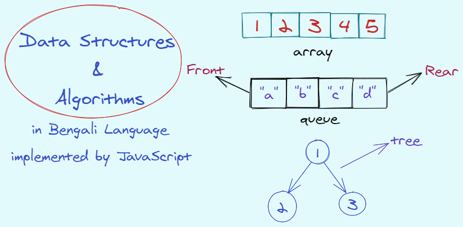

# ডেটা স্ট্রাকচার ও অ্যালগরিদম

ডেটা স্ট্রাকচার ও অ্যালগরিদম সহজে বাংলা ভাষায় জাভাস্ক্রিপ্ট দিয়ে বুঝার জন্য টিউটোরিয়াল।

## ডেটা স্ট্রাকচার

মেমোরিতে ডেটা বিভিন্নভাবে সাজানো এবং সংরক্ষিত করার পদ্ধতি হল ডেটা স্ট্রাকচার। ডেটা স্ট্রাকচার জানা থাকলে আমরা মেমোরি ইফিশিয়েন্ট ও লেস টাইম কনজিউমিং কোড লেখতে পারব, যা আমাদেরকে ভাল প্রোগ্রামার হতে এবং ইন্টারভিউতে অনেক সাহায্য করবে।

## অ্যালগরিদম

অ্যালগরিদম হল একটি নির্দিষ্ট সমস্যা সমাধানের ধাপ।

## সূচীপত্র

- [কমপ্লেক্সিটি](complexity/README.md)
- [ডেটা স্ট্রাকচার](data-structure/README.md)
- [অ্যালগরিদম](algorithm/README.md)
- [ট্রি ট্রাভার্সাল](tree-traversal/README.md)
- [রিকার্শন](recursion/README.md)

## কন্ট্রিবিউশন

আপনি চাইলে পি.আর সাবমিট করে কন্ট্রিবিউট করতে পারবেন।

## কপিরাইট

The materials herein are all &copy; 2019-2020 Muhammad Lahin.
