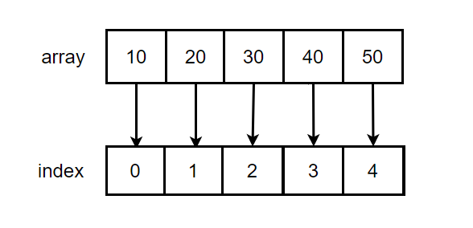

# এ্যারে

এ্যারে সবচেয়ে সহজ এবং সবচেয়ে বেশি ব্যবহৃত ডেটা স্ট্রাকচার। অন্যান্য ডেটা স্ট্রাকচার যেমন স্ট্যাক, কিউ এ্যারে দিয়ে ইমপ্লিমেন্ট করা যায়।

একটি এ্যারেতে একটি কিংবা একাধিক ভ্যালু স্টোর করে রাখা যায়। ভ্যালু নাম্বার, স্ট্রিং ইত্যাদি হতে পারে। প্রতিটা ভ্যালুতে তার নিজস্ব ইন্ডেক্স থাকে যা দ্বারা প্রতিটা ভ্যালুকে আইডেন্টিফাই করা যায়।

যেমন, একটি এ্যারে যার ভিতর ৫টি ভ্যালু আছে, `let arr = [10, 20, 30, 40, 50]`

<p align="center">
	
</p>

আমরা চাইলে এ্যারের ভ্যালুকে তার ইন্ডেক্স দ্বারা কল করতে পারি, `arr[2]` তা আমাদেরকে 30 ভ্যালু রিটার্ণ করবে।
চাইলে ভ্যালুকে তার ইন্ডেক্স দ্বারা কল করে ডিলিট করতে পারি,

```
let arr = [10, 20, 30, 40, 50];
arr.splice(2, 1); // 2 is index
// [10, 20, 40, 50]
```

নির্দিষ্ট ইন্ডেক্স দিয়ে এ্যারের কোনো উপাদান এক্সেস করতে গেলে টাইম কমপ্লেক্সিটি হবে, O(1)

এ্যারের কোনো উপাদান যোগ করতে চাইলে তার কমপ্লেক্সিটি হবে, O(n)

এ্যারের কোনো উপাদান বাদ দিতে চাইলে তারও কমপ্লেক্সিটি হবে, O(n)
