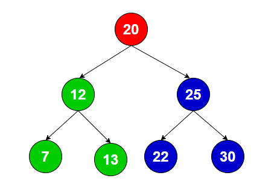
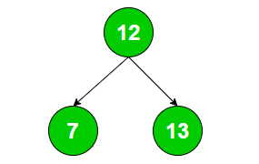
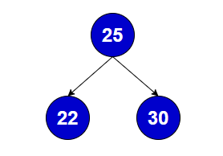

# বাইনারি সার্চ ট্রি

বাইনারি সার্চ ট্রি, বাইনারি ট্রি ডেটা স্ট্রাকচার। কোনো একটি বাইনারি ট্রি'র বাঁ-দিকের সাবট্রির প্রতিটি নোডের মান যখন রুট নোডের মানের চেয়ে ছোট হয় এবং ডানদিকের সাবট্রির প্রতিটি নোডের মান রুট নোডের মানের চেয়ে বড় হয় তখন সেই ট্রি হচ্ছে বাইনারি সার্চ ট্রি।

	

উপরের ট্রি হল একটি বাইনারি সার্চ ট্রি। কিভাবে? বাইনারি সার্চ ট্রির নিয়মগুলো প্রয়োগ করে দেখি,

রুট নোড(20) এর বাঁ দিকের সাবট্রি ট্রাভার্স করলে দেখব,

	

- নোড 12, 7, 13 যা 20 থেকে ছোট
- সাবট্রির রুট নোড 12 যার বাঁ দিকের নোড 7(ছোট) এবং ডানদিকের নোড 13(বড়)

সুতরাং, রুট নোড(20) এর বাঁ দিকের সাবট্রি বাইনারি সার্চ ট্রির নিয়ম মেনে চলছে।

এখন রুট নোড(20) এর ডানদিকের সাবট্রি ট্রাভার্স করলে দেখব,

	

- নোড 25, 22, 30 যা 20 থেকে বড়
- সাবট্রির রুট নোড 25 যার বাঁ দিকের নোড 22(ছোট) এবং ডানদিকের নোড 30(বড়)

সুতরাং, রুট নোড(20) এর ডানদিকের সাবট্রিও বাইনারি সার্চ ট্রির নিয়ম মেনে চলছে। তাহলে আমরা বলতে পারি সম্পূর্ণ ট্রি-টি হচ্ছে একটি বাইনারি সার্চ ট্রি।
