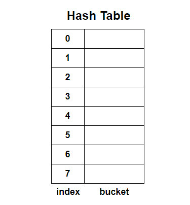
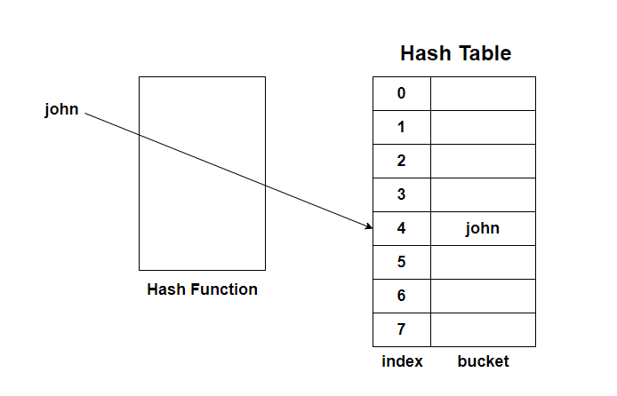
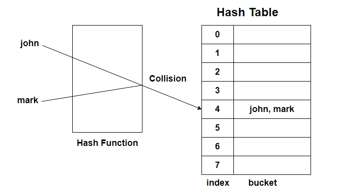

# হ্যাশ টেবিল

হ্যাশ টেবিল একটি ডেটা স্ট্রাকচার যাতে ডেটাগুলো কি(key) ও ভ্যালু(value) সমন্বয়ে থাকে। হ্যাশ টেবিল হ্যাশ ফাংশন ব্যবহার করে একটি ভ্যালুর জন্য একটি ইন্ডেক্স তৈরি করে তারপর সেই ইন্ডেক্স অনুযায়ী ভ্যালুটিকে এ্যারের ভিতরে রেখে দেয়।

একটি হ্যাশ টেবিল দেখতে এরকম হয়ে থাকে।

<p align="center">
	
</p>

আমরা এই Bucket এর ভিতর ডেটাগুলো রাখব, কোন ইন্ডেক্সে? সেটা আমাদেরকে হ্যাশ ফাংশন বলে দিবে।

একটি হ্যাশ ফাংশন বিভিন্নভাবে তৈরি করা যেতে পারে, যেমন একটি ছোট হ্যাশ ফাংশন এরকম হতে পারে,

```js
function generateHash(table_size, data) {
  let index;
  let data_length = data.length;

  index = data_length % table_size;
  return index;
}
```

`generateHash` ২'টি প্যারামিটার গ্রহণ করবে `table_size` ও `data`। `table_size` হল আমাদের হ্যাশ টেবিলের সাইজ যা উপরের ছবি দেখে বলা যেতে পারে ৮ এবং `data` হল আমাদের ডেটা।

`generateHash` ফাংশনটি `data` ও `table_size` এর ভিতর মডুলাস করে একটি ইন্ডেক্স রিটার্ণ করবে। তারপর সেই ইন্ডেক্স অনুযায়ী হ্যাশ টেবিলে গিয়ে ডেটা'টি বসবে।

যেমনঃ `data` যদি `john` হয় তাহলে ইন্ডেক্স আসবে, 4 % 8 অর্থাৎ 4।

<p align="center">
	
</p>

এখন 4 লেন্থ এর আরেকটি ডেটা যেমনঃ `mark` হ্যাশ টেবিলে প্রবেশ করাতে চাইলে, তখন একটি কলিশন(Collision) তৈরি হবে।

<p align="center">
	
</p>

এরকম কলিশন তৈরি হলে আমরা যা করতে পারি তা হল হ্যাশ টেবিলের দিকে তাকিয়ে যে ইন্ডেক্স খালি আছে সেখানে ডেটা প্রবেশ ক্রাতে পারি।

হ্যাশ টেবিল ব্যবহারের সুবিধা হল, আমরা যদি এভারেজ কেস চিন্তা করি ডেটা ইন্সার্ট ও সার্চিং আমরা O(1) টাইম কমপ্লেক্সিটি'তে সম্পন্ন করতে পারব। যেমনঃ `mark` সার্চ করতে চাইলে, আমরা হ্যাশ ফাংশনে `mark` দিয়ে দিলে যে ইন্ডেক্স রিটার্ণ করবে সেই ইন্ডেক্স দিয়ে আমরা হ্যাশ টেবিল থেকে বের করতে পারব।

ডেটা ডিলিট এর ক্ষেএেও টাইম কমপ্লেক্সিটি O(1) হবে।

আর যখন কোনো কলিশন তৈরি হবে তখন টাইম কমপ্লেক্সিটি O(n) হয়ে যাবে।
