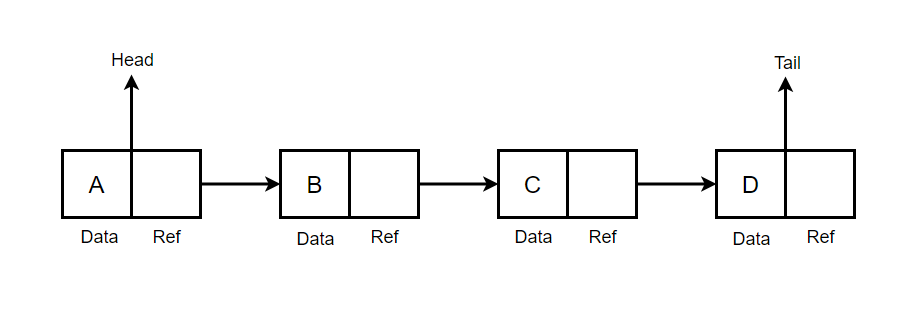
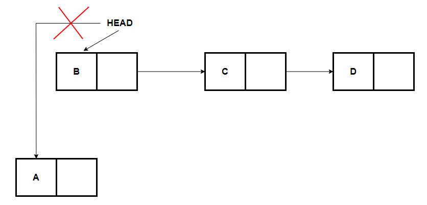
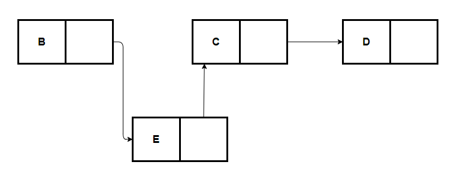
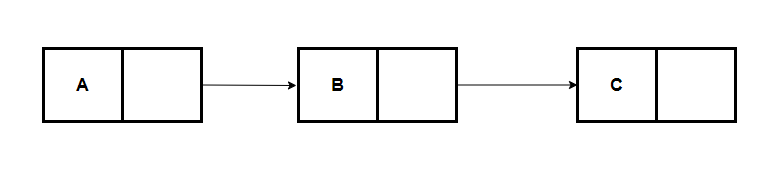
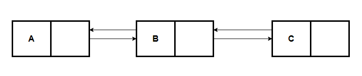

# লিংকড লিস্ট

লিংকড লিস্ট এমন একটি লিনিয়ার ডেটা স্ট্রাকচার যার ভিতর একেক ডেটা/নোড একেক জায়গাতে অবস্থান করে, তাই ইন্ডেক্স দিয়ে ডেটা সরাসরি বের করা যায় না। তবে প্রতিটা ডেটা বা নোড একে অপরের সাথে একটি লিংক দ্বারা সংযুক্ত থাকে। যার কারণে একে লিংকড লিস্ট বলা হয়।

লিংকড লিস্টের উপকারিতা হল, এতে এক্সট্রা মেমোরি বাকি থাকে না। যতগুলো ডেটা প্রয়োজন ততগুলো নোড থাকবে।

লিংকড লিস্টের শুরুতে যে নোড থাকে তাকে Head এবং শেষে যে নোড থাকে তাকে Tail বলে।

	

উপরের ছবিতে দেখা যাচ্ছে,

- A নোডের লিংক B নোডের সাথে
- B নোডের লিংক C নোডের সাথে
- C নোডের লিংক D নোডের সাথে
- D নোডের লিংক কারোর সাথে সংযুক্ত করা নাই

প্রতিটা নোড একে অপরের সাথে কানেক্টেড রয়েছে, শুধু D নোড নিজে কারও সাথে কানেক্টেড নাই সেজন্য D নোডকে Tail নোড বলে।

আমরা চাইলে লিস্টের শুরুতে নতুন নোড ইনসার্ট করতে পারব,

	

উপরের ছবিতে A নোডের Head রেফারেন্স পরিবর্তন করে নতুন নোড(B) এর সাথে সংযুক্ত করে দিয়েছি, যার কারণে A নোডটি আমাদের লিস্ট থেকে বাদ পড়ে গেল। তখন HEAD হয়ে যাবে B নোড, HEAD এর রেফারেন্স পরিবর্তন করার টাইম কমপ্লেক্সিটি হবে O(1)।

এখন আমরা চাইলে লিস্টের যেকোন পজিশনে নতুন নোড ইনসার্ট করাতে পারব।

	

উপরের ছবিতে B নোডের রেফারেন্স নতুন নোড(E) এর সাথে সংযুক্ত হচ্ছে, এই নতুন নোড(E) এর রেফারেন্স C নোডের সাথে সংযুক্ত হচ্ছে।

এই নতুন নোড যোগ করতে টাইম কমপ্লেক্সিটি (worst case scenario) হবে O(n)।

ঠিক একই ভাবে কোনো নোডকে এক্সেস করতে চাইলে আমাদের শুরু থেকে শেষ পর্যন্ত(worst case scenario) ট্রাভার্স করতে হবে সেজন্য টাইম কমপ্লেক্সিটি হবে O(n), ডিলিট অপারেশন এর জন্যও একই O(n)।

লিংকড লিস্ট সাধারণত দুই রকমের হয়ে থাকে, Singly Linked List এবং Doubly Linked List

## সিংগলী লিংকড লিস্ট

যে লিংকড লিস্টের প্রতিটি নোড একটি এজ দিয়ে অন্য নোডের সাথে একদিক বরাবর কানেক্টেড অবস্থায় থাকে তাহলে তাকে সিংগলী লিংকড লিস্ট বলে।

	

## ডাবলী লিংকড লিস্ট

যে লিংকড লিস্টের প্রতিটি নোড একের বেশি এজ দিয়ে অন্য নোডের সাথে সোজা ও বিপরীত দিক বরাবর কানেক্টেড অবস্থায় থাকে তাহলে তাকে ডাবলী লিংকড লিস্ট বলে।

	

