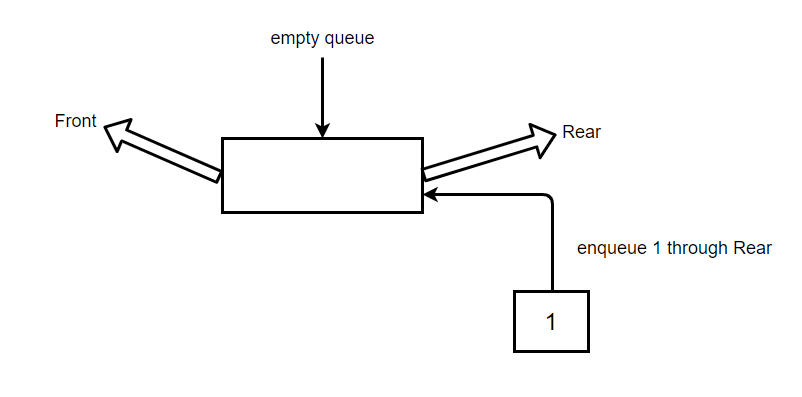
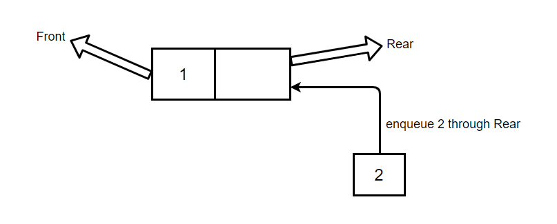
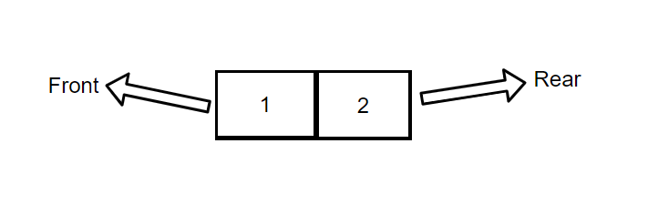
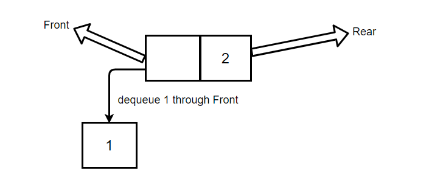
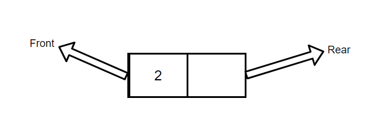

# কিউ

কিউ একটি লিনিয়ার ডেটা স্ট্রাকচার। কিউতে দুটি প্রান্ত থাকে যা সবসময় খোলা থাকে, যাদের বলা হয় REAR এবং FRONT। REAR এ ভ্যালু প্রবেশ করানো এবং FRONT থেকে ভ্যালু ডিলিট করা হয়ে থাকে। ভ্যালু ইন্সার্ট করাকে enqueue এবং ভ্যালু ডিলিট করাকে dequeue বলে।

পিকচার ১ঃ কিউ তে একটি ভ্যালু REAR এর ভিতর দিয়ে প্রবেশ করানো হচ্ছে।

	

পিকচার ২ঃ কিউ তে আরেকটি ভ্যালু REAR এর ভিতর দিয়ে প্রবেশ করানো হচ্ছে।

	

এখন কিউ দেখতে এরকম হবে,

	

উপরের ছবি গুলোতে আমরা কিউ তে ইনসার্ট করা দেখেছি। এখন ভ্যালু ডিলিট কিভাবে করে দেখে নিই,

	

উপরের ছবিতে দেখা যাচ্ছে, ফ্রন্ট থেকে 1 ডিলিট হয়েছে।

তাহলে কিউ এর বর্তমান অবস্থা হবে,

	

এখন কিউ এর ফ্রন্টে শুধু 2 আছে।

মনে রাখতে হবে, কিউ সবসময় FIFO অথবা First-in First-out প্যাটার্ণ মেনে চলে, মানে কিউতে প্রথম যে ভ্যালু প্রবেশ করবে সেটা প্রথমে বাদ যাবে।
