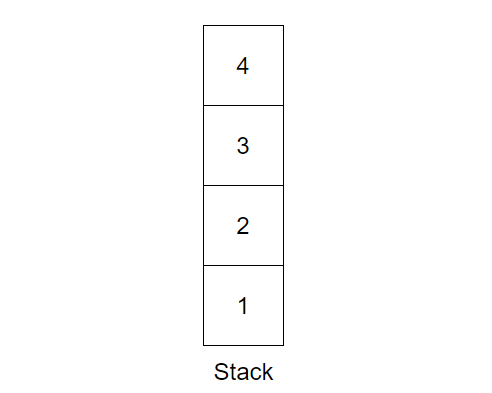
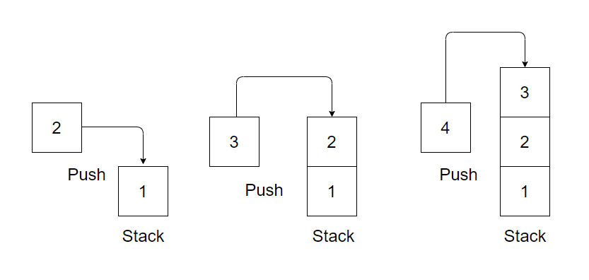
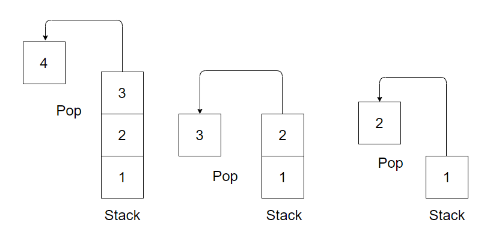
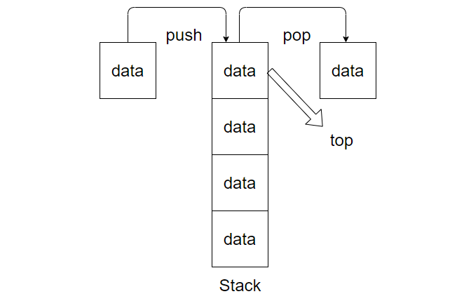

# স্ট্যাক

স্ট্যাক গুরুত্বপূর্ণ লিনিয়ার ডেটা স্ট্রাকচার, যার ভিতর ডেটা স্থুপ আকারে থাকে। যেখানে সাধারণত ২ ধরনের কাজ হয়ে থাকে, `push` এবং `pop` ।

	

উপরের ছবিতে দেখা যাচ্ছে ভ্যালুগুলো একটির উপর আরেকটি স্থুপ আকারে আছে।

stack এ যে ২ রকমের কাজ হয়ে থাকে,

- push, স্ট্যাকে কিছু রাখতে চাইলে push ব্যবহার করতে হয়।

	

- pop, স্ট্যাক থেকে কিছু ডিলিট করতে চাইলে pop ব্যবহার করতে হয়।

	

স্ট্যাক সবসময় Last-in First-out প্যাটার্ণ মেনে চলে, মানে ভ্যালু উপর বা Top এ প্রবেশ করবে এবং ভ্যালু উপর থেকে ডিলিট হবে।

	

