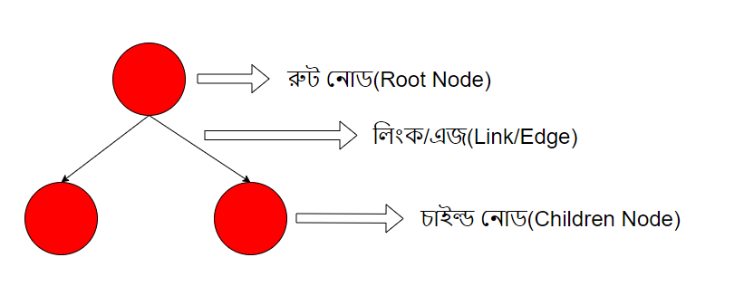
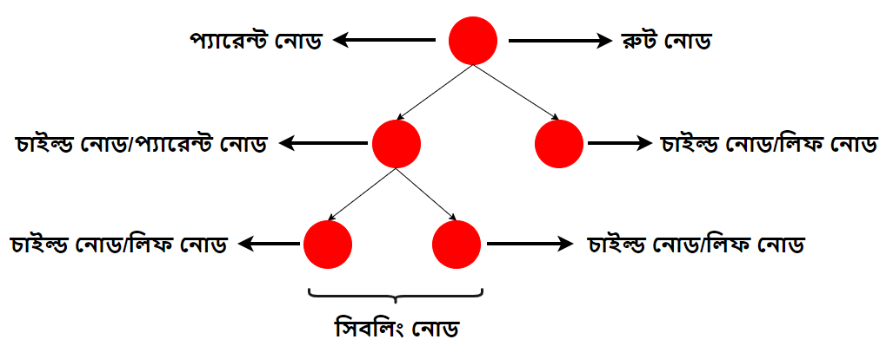

# ট্রি

ট্রি হল একটি নন-লিনিয়ার ডেটা স্ট্রাকচার, যার মানে হল ডেটাগুলো কোনো সিকুয়েন্স কিংবা লিনিয়ার আকারে থাকবে না। যেহেতু এরা কোনো সিকুয়েন্স মেনে চলে না সেহেতু আমরা একবার লুপ করে সব মান বের করতে পারব না।

	

একটি ট্রি সাধারণত এরকম হয়ে থাকে। যাতে, ১টি রুট নোড থাকবে যা বাধ্যতামূলক, সাথে এজ, চাইল্ড নোড থাকতে পারে। এজ দিয়ে চাইল্ড নোডকে কানেক্ট করা হয়।

যে নোড থেকে চাইল্ড নোড আসে তাকে প্যারেন্ট নোড, চাইল্ড নোড'গুলোকে একে অপরের সিবলিং(Sibling) নোড বলে এবং যেসব নোডের কোনো চাইল্ড নোড থাকবে না তাদেরকে লিফ(Leaf) নোড বলে। নিচের ছবি দেখুন।

	

ট্রি ব্যবহারের সুবিধা হল, কোনো কিছু সার্চ করা, তা লিংকড লিস্টের ব্যবহারের চেয়ে দ্রুত হয়। ইনসার্ট কিংবা ডিলিট অপারেশন এ্যারে ব্যবহারের চেয়ে দ্রুত হয়।

বাস্তব জীবনে ট্রি ডেটা স্ট্রাকচার ব্যবহার করে প্রচুর এপ্লিকেশন ডেভেলপ করা হয়েছে।

ট্রি ডেটা স্ট্রাকচারের সবচেয়ে গুরুতবপূর্ণ বিষয়গুলো হচ্ছে,

- [বাইনারি ট্রি](./binary-tree/README.md)
- [ট্রি-ট্রাভার্সাল](./tree-traversal/README.md)
