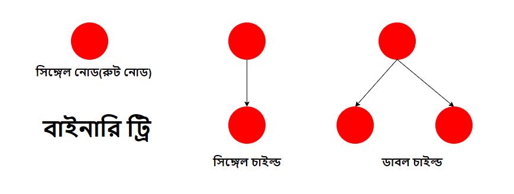
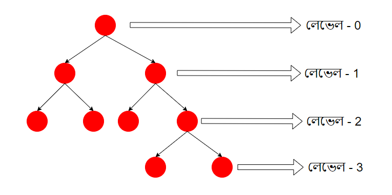
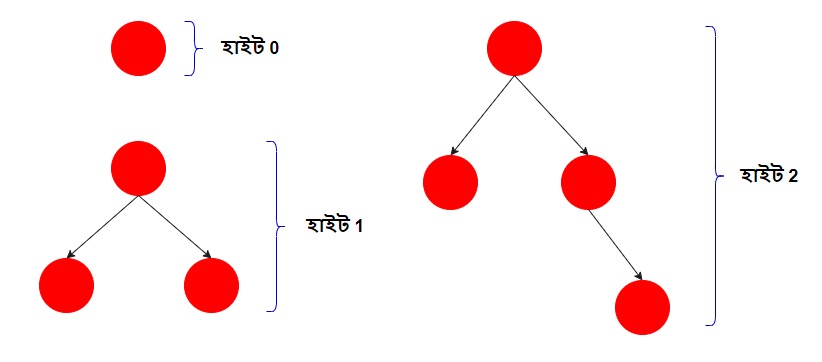

# বাইনারি ট্রি

ট্রি'র প্রতিটি নোডে অনেকগুলো চাইল্ড থাকতে পারে। কিন্তু বাইনারি ট্রি হচ্ছে এমন একটি ট্রি, যেখানে সর্বোচ্চ দুটি চাইল্ড নোড থাকতে পারবে। যার শর্তাবলী হচ্ছে,

- শুধু একটি নোড(রুট নোড)
- একটি নোডের একটি চাইল্ড নোড
- একটি নোডের দুইটি চাইল্ড নোড

এই তিনটির যেকোন একটি হলে সেটা বাইনারি ট্রি।

	

বাইনারি ট্রি-তে সর্বোচ্চ দু'টি চাইল্ড নোড থাকতে পারে, যার বাঁ দিকের নোডকে লেফট নোড এবং ডান দিকের নোডকে রাইট নোড বলে।

ট্রি'র নোডগুলোর বিভিন্ন লেভেল থাকে। রুট নোডকে লেভেল 0, যার পরের নোডকে লেভেল 1, তার পরের নোডকে লেভেল 2 এরকম যেতে থাকবে।

	

লেভেলের মত ট্রি-তে হাইটও থাকে।

	

