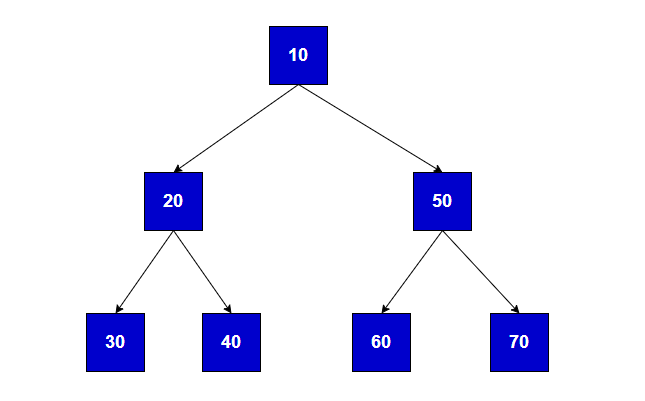

# ট্রি-ট্রাভার্সাল

এ্যারে ট্রাভার্সিং এর মত আমরা ট্রি'ও ট্রাভার্স করতে পারি, কিন্তু ট্রি-ট্রাভার্সিং এ্যারে ট্রাভার্সিং-এর মত হয় না। ট্রি-ট্রাভার্সিং সাধারণত ৩টি রিকার্সিভ নিয়মে করা যায়।

- প্রি-অর্ডার
- পোস্ট-অর্ডার
- ইন-অর্ডার

## প্রি-অর্ডার

এই পদ্ধতিতে প্রথমে,

- রুট নোড
- তারপর বাঁ-দিকের সাবট্রি
- শেষে ডানদিকের সাবট্রি ট্রাভার্স করতে হয়।

নিচে একটি উদাহরণ দেয়া হল,

	

উপরের ছবিতে প্রি-অর্ডার ট্রাভার্সিং হবে এরকম, প্রথমে রুট নোড 10 ট্রাভার্স করা শুরু করব, তারপর 10 এর বাঁ-দিকের সাবট্রি ট্রাভার্স করব, তখন সেই ট্রি এর রুট নোড হবে 20, 20 এর বা-দিকের সাবট্রি ট্রাভার্স করলে আমরা পাব 30, 30 এর যেহেতু আর কোনো চাইল্ড নোড নাই সেহেতু আমরা এবার 20 ডানদিকের সাবট্রি ট্রাভার্স করলে আমরা পাব 40, 40 একটি লিফ নোড সেখানে আর ট্রাভার্স করার কিছু নাই। রুট নোডের মানে 20 এর বাঁ এবং ডান সাবট্রি ট্রাভার্স করার কাজ শেষ।

এখন ট্রি এর বাঁ দিকের সাবট্রি প্রি-অর্ডার ট্রাভার্সিং অনুযায়ী ট্রাভার্স করা শেষ আমরা 20 এর প্যারেন্ট নোড মানে 10 এর ডান দিকের সাবট্রি ট্রাভার্স করব।

তাহলে সেই সাবট্রি এর রুট নোড হবে 50, এর বাঁ-দিকের সাবট্রি-ট্রাভার্স করলে আমরা পাব 60, 60 যেহেতু একটি লিফ নোড, তাই আমরা 50 এর ডান-দিকের সাবট্রি ট্রাভার্স করলে আমরা পাব 70, 70 যেহেতু একটি লিফ নোড তার মানে আমাদের সম্পূর্ণ ট্রি-ট্রাভার্স করা শেষ।

প্রি-অর্ডার ট্রাভার্সালে নোডগুলোর ট্রাভার্সিং সিকুয়েন্স ছিলঃ 10 20 30 40 50 60 70

## পোস্ট-অর্ডার

এই পদ্ধতিতে প্রথমে,

- রুট নোডের বাঁ দিকের সাবট্রিকে
- তারপর ডান দিকের সাবট্রিকে
- শেষে রুট নোডকে ভিজিট করতে হয়।

নিচে একটি উদাহরণ দেয়া হল,

	

উপরের ছবিতে পোস্ট-অর্ডার ট্রাভার্সিং হবে এরকম, প্রথমে রুট নোডের বাঁ দিকের সাবট্রি থেকে শুরু হবে, তখন সেই ট্রি এর রুট নোড 20 পোস্ট-অর্ডার ট্রাভার্সিং অনুযায়ী আমারা আবার বাঁ দিকের নোড ট্রাভার্স করব যেখানে 30 একটি লিফ নোড, তাই আমরা এখন 20 এর ডানদিকের সাবট্রি ট্রাভার্স করব যেখানে 40 একটি লিফ নোড। যেহেতু 40 লিফ নোড এখানে আর টাভার্স করার মত কিছু নাই, তাই আমরা এখন রুট নোড মানে 20 কে ট্রাভার্স করব।

রুট নোড 10 এর বাঁ দিক ট্রাভার্স করা শেষ। এখন ডানদিকের সাবট্রি ট্রাভার্স করব।

তাহলে সেই সাবট্রির রুট নোড হবে 50, এর বাঁ দিকের সাবট্রি থেকে ট্রাভার্স করা শুরু করলে দেখব লিফ নোড 60, যেহেতু লিফ নোড সেহেতু আমরা 50 এর ডানদিকের সাবট্রি ট্রাভার্স করলে দেখব 70 লিফ নোড। 50 এর বাঁ ও ডানদিকের সাবট্রি ট্রাভার্স করা শেষ, তাই এখন রুট নোড 50 কে ট্রাভার্স করব।

রুট নোড 10 এর ডানদিক ট্রাভার্স করা শেষ। এখন সেই রুট নোড 10 কে ট্রাভার্স করব।

তাহলে ট্রাভার্সিং সিকুয়েন্স হবেঃ 30 40 20 60 70 50 10

## ইন-অর্ডার

এই পদ্ধতিতে প্রথমে,

- বাঁ দিকের সাবট্রি
- তারপর রুট নোড
- শেষে ডানদিকের সাবট্রিকে ট্রাভার্স করতে হয়।

নিচে একটি উদাহরণ দেয়া হল,

	

উপরের ছবিতে ইন-অর্ডার ট্রাভার্সিং হবে এরকম, প্রথমে রুট নোড 10 এর বাঁ দিকের সাবট্রি থেকে শুরু হবে যার রুট নোড 20, তার বাঁ দিকের নোড 30 কে ট্রাভার্স করব যা একটি লিফ নোড তারপর রুট নোড 20 কে ট্রাভার্স করব এবং পরে ডান দিকের নোড 40 কে ট্রাভার্স করব।

আমাদের রুট নোডের(10) বাঁ দিকের ট্রাভার্সিং শেষ এখন রুট নোড 10 কে ট্রাভার্স করব।

তারপর রুট নোডের ডানদিকের সাবট্রিকে ট্রাভার্স করব। তখন রুট নোড হবে 50। রুট নোডের বাঁ দিকের চাইল্ড নোডকে(60) প্রথমে ট্রাভার্স করব। তারপর রুট নোড 50 কে ট্রাভার্স করব, এরপর ডানদিকের সাবট্রি 70 কে ট্রাভার্স করব।

রুট নোডের(10) ডানদিকের ট্রাভার্সিং শেষ।
